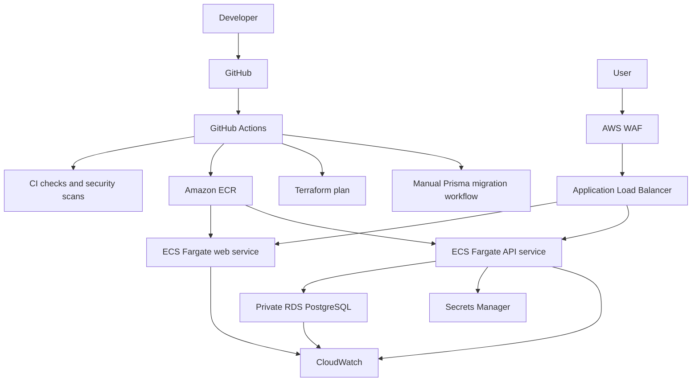

# SecureBank

SecureBank is a cloud DevSecOps project built around a simple banking-style web app. The app is intentionally small; the main work is the platform around it: CI/CD, containers, Terraform, AWS deployment, monitoring, security controls, runbooks, and evidence.

## Why I Built This

Most sample projects stop at "the app runs." I wanted this repo to show how I think about the work around an app:

- Can another engineer run it locally?
- Are builds, scans, and Docker images automated?
- Is AWS access handled without long-lived keys?
- Is infrastructure defined in code and reviewed before apply?
- Are the database, network, and runtime services private where they should be?
- Is there enough evidence to explain the project in an interview?

SecureBank is my answer to those questions.

## Current Architecture



The dev environment uses ECS Fargate, an internet-facing ALB, private app subnets, private database subnets, encrypted RDS PostgreSQL, Secrets Manager, CloudWatch, VPC endpoints, and AWS WAF. NAT Gateway is disabled by default for cost control.

More detail: [docs/architecture.md](docs/architecture.md)

## What Is In The Repo

```text
apps/
  web/        Next.js frontend
  api/        Express API with Prisma
infra/
  terraform/ Modular AWS Terraform
docs/         Case study, runbooks, evidence, cleanup guide
.github/
  workflows/ CI, Terraform plan, image push, migrations
```

## Tech Stack

- Next.js, TypeScript, Tailwind CSS
- Node.js, Express, Prisma
- PostgreSQL
- Docker and Docker Compose
- GitHub Actions
- Terraform
- AWS ECS Fargate, ALB, ECR, RDS, Secrets Manager, CloudWatch, WAF, S3, DynamoDB, IAM
- npm audit, Trivy, Checkov

## CI/CD

The project uses separate workflows instead of one giant pipeline:

- CI validates dependencies, linting, type checks, builds, Prisma generation, Docker builds, and security scans.
- ECR image push builds web/API images and pushes them using GitHub OIDC.
- Terraform plan authenticates to AWS with OIDC and stops at review.
- Database migrations are manual and run as an ECS one-off task.

Terraform apply is intentionally manual. That keeps infrastructure changes reviewable and avoids accidental deployment from a normal push.

## Security Controls

The main security decisions are:

- GitHub Actions uses OIDC instead of static AWS keys.
- RDS is private, encrypted, and only reachable from the API service.
- ECS tasks run in private subnets.
- Security groups enforce internet -> ALB -> ECS -> RDS.
- WAF is attached to the ALB and starts in count mode.
- App and ALB security headers are configured.
- Terraform state is designed for S3 encryption and DynamoDB locking.
- CI includes dependency, filesystem, and IaC scanning.

Full list: [docs/security-controls.md](docs/security-controls.md)

## Monitoring And Operations

The dev stack includes:

- CloudWatch logs for web and API containers
- CloudWatch alarms for ALB 5xx, target health, ECS CPU/memory, RDS CPU, and RDS storage
- Optional ALB access log support
- Runbooks for rollback, API health failures, database failures, and migrations
- Cleanup guidance for shutting down AWS resources after demos

Runbooks:

- [Deployment rollback](docs/runbooks/deployment-rollback.md)
- [API health check failure](docs/runbooks/api-healthcheck-failure.md)
- [Database connection failure](docs/runbooks/database-connection-failure.md)
- [Database migrations](docs/runbooks/database-migrations.md)

## Evidence

The repo includes written evidence for the major cloud phases:

- [Phase 5C deployment evidence](docs/evidence/phase-5c-deployment.md)
- [Phase 5D hardening evidence](docs/evidence/phase-5d-hardening.md)
- [Phase 6 security and compliance evidence](docs/evidence/phase-6-security-compliance.md)
- [Screenshot checklist](docs/screenshots/README.md)

Screenshots are intentionally separate so account-sensitive AWS details can be reviewed and redacted before they are added.

## Local Development

Install dependencies:

```bash
npm install
```

Create local env files:

```bash
cp apps/web/.env.example apps/web/.env
cp apps/api/.env.example apps/api/.env
```

Start PostgreSQL and pgAdmin:

```bash
docker compose up -d postgres pgadmin
```

Prepare Prisma:

```bash
npm run prisma:generate -w apps/api
npm run prisma:migrate -w apps/api
```

Run the apps:

```bash
npm run dev
```

Local URLs:

- Web: http://localhost:3000
- API: http://localhost:4000
- pgAdmin: http://localhost:5050

Full Docker stack:

```bash
docker compose up --build
```

## Useful Checks

```bash
npm run format
npm run lint --workspaces
npm run typecheck --workspaces
npm run build --workspaces
docker compose config
```

Terraform:

```bash
cd infra/terraform/environments/dev
terraform init
terraform validate
terraform plan
```

Do not commit `.env`, `terraform.tfvars`, `.terraform/`, `.tfstate`, `.tfplan`, AWS keys, database passwords, or private keys.

## Documentation

- [Project case study](docs/project-case-study.md)
- [Architecture](docs/architecture.md)
- [Interview guide](docs/interview-guide.md)
- [Resume bullets](docs/resume-bullets.md)
- [Compliance mapping](docs/compliance-mapping.md)
- [AWS cleanup guide](docs/aws-cleanup-guide.md)
- [Final checklist](docs/final-project-checklist.md)

## Interview Notes

The strongest talking points for this project are:

- Why OIDC is safer than static AWS credentials
- How the private ECS/RDS network is structured
- Why Terraform plan and apply are separated
- How database migrations are handled safely
- What was monitored in CloudWatch and why
- How WAF was introduced in count mode before block mode
- How costs were controlled during development

Full prep doc: [docs/interview-guide.md](docs/interview-guide.md)
