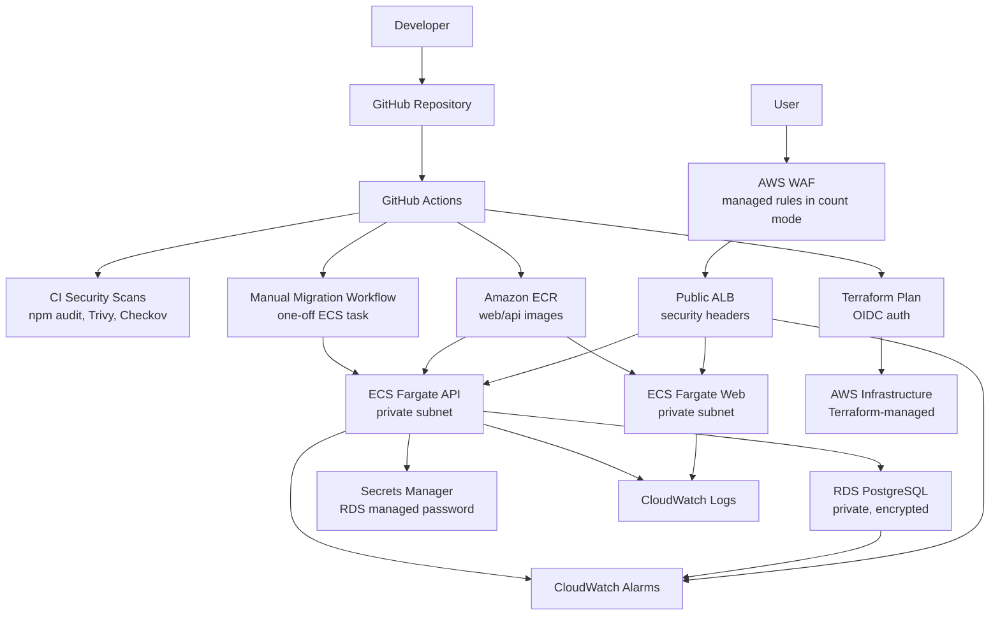

# Architecture

SecureBank is a DevSecOps portfolio platform with local development, CI/CD automation, container delivery, deployed AWS dev infrastructure, monitoring, and security controls.

## AWS Dev Architecture



## Request Flow

```text
Internet -> AWS WAF -> ALB -> ECS web/API -> private RDS
```

## Deployment Flow

```text
GitHub Actions -> OIDC -> ECR image push -> Terraform plan review -> controlled apply
```

## Security Flow

```text
CI scans -> OIDC auth -> WAF telemetry -> security headers -> private network tiers -> CloudWatch alarms
```
