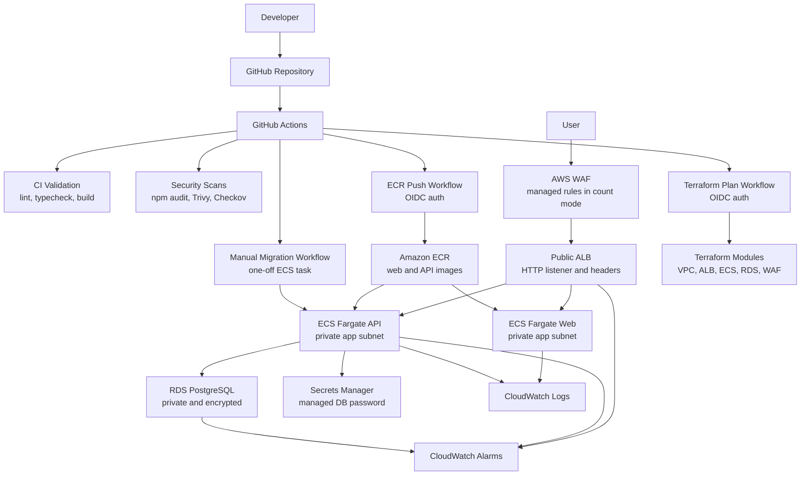
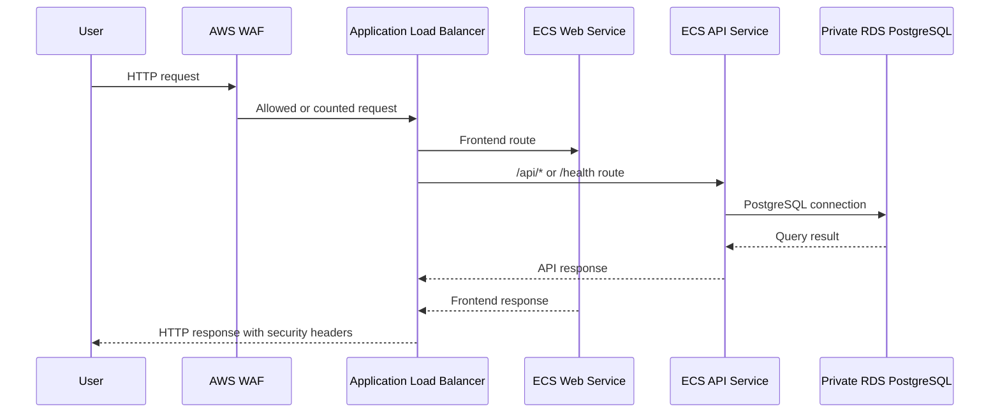
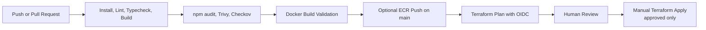
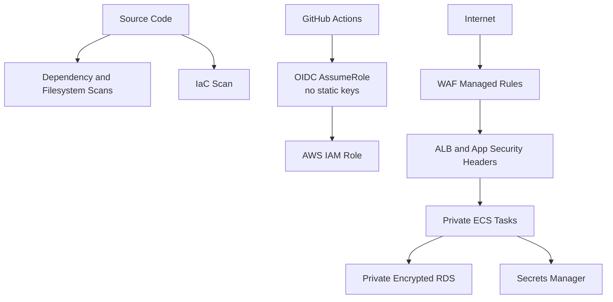
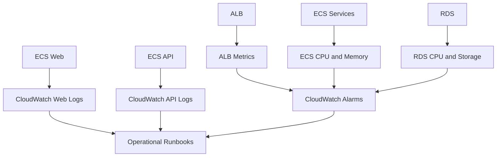

# Architecture

SecureBank is a DevSecOps platform with local development, CI/CD automation, container delivery, AWS infrastructure as code, monitoring, and security controls.

The AWS dev environment is Terraform-managed and can be destroyed after demos to control cost. The diagram below shows the environment when it is deployed.

## High-Level Architecture

## Request Flow

## CI/CD Flow

## Security Flow

## Monitoring Flow

## Network Boundaries

- Public: ALB only
- Private app tier: ECS web and API tasks
- Private database tier: RDS PostgreSQL
- Secrets: Secrets Manager, referenced by ECS runtime configuration
- Observability: CloudWatch logs and alarms

## Cost Boundary

NAT Gateway is disabled by default. The dev environment uses VPC endpoints for required AWS service access and can be destroyed after demos to control AWS cost.
